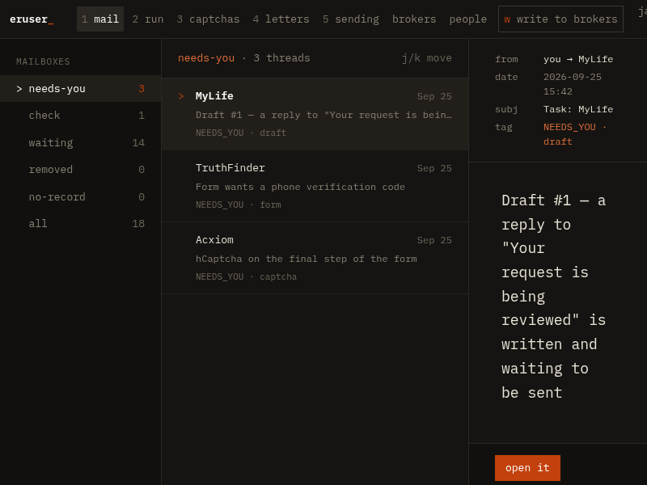
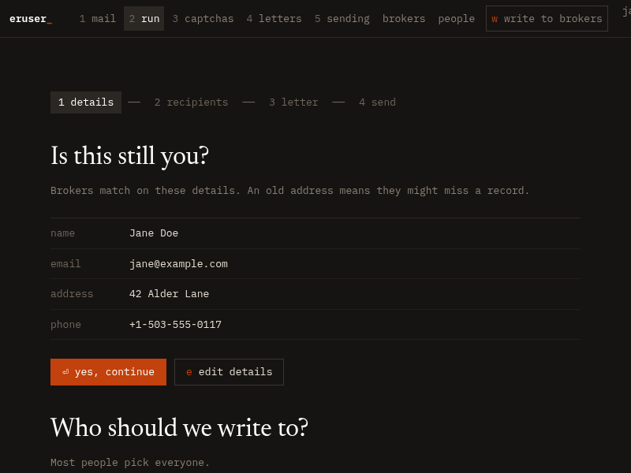
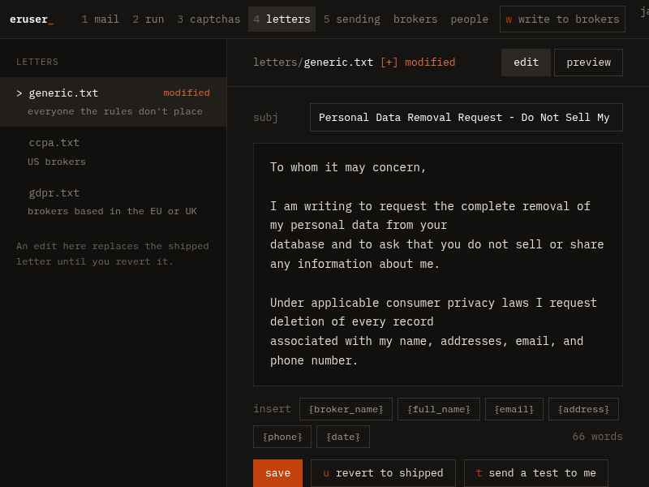
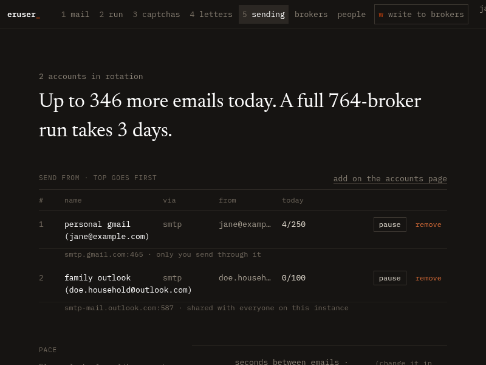
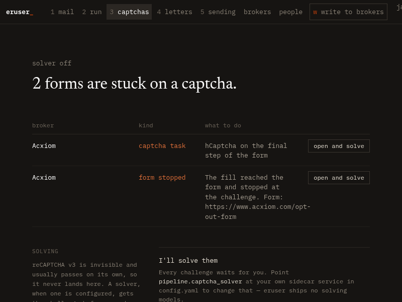

<div align="center">


# eruser

**Take back your privacy. Send data removal requests to 750+ data brokers, from your own machine, for free.**

A fork of [eraser](https://github.com/digisamroc/eraser), rewritten in Rust.

</div>

---

There is an entire industry built on collecting your home address, your phone number, your relatives' names, and your old addresses, then selling that bundle to anyone who pays. The companies doing it are called data brokers, and there are hundreds of them. Paid services will handle the opt-out paperwork for around $100 a year. eruser does the same job, except it's open source, it runs on your own machine, and it costs nothing.

## The interface

eruser runs as a local web app. Everything it knows — what was sent, what came back, what still needs a human — is one keystroke away.

**Mail** — every broker reply, sorted by what it means and what it needs from you.

<div align="center">

</div>

**Run** — start a send, watch it roll across the broker database and from mailbox to mailbox as daily limits are hit.

**Letters** — read and reword the exact request each region gets, preview it rendered for a real broker, test-send it to yourself.

**Sending** — the mailboxes in rotation, what each has sent, and what they have left today.

**Captchas** — the forms a machine refused to finish, waiting for you.

| | |
|---|---|
|  |  |
|  |  |

## What to Expect

**What works well:** eruser sends removal request emails to 750+ brokers. A good number of them handle these automatically — the email arrives, your record comes out, and that's the end of it.

**Where it gets tedious:** Plenty of brokers won't make it that easy. Some mail back a confirmation link. Some want you to fill in a form on their site. Some ask you to prove you're really you. eruser reads the replies, sorts them, and tells you exactly which ones still need you.

**Worth knowing:** Brokers are allowed 30 to 45 days to act, depending on which law applies. Data also gets re-bought and re-listed, so this is something you repeat rather than finish. Running it every few months is the point.

**The tradeoff:** You do a bit of manual work on the stubborn ones. In exchange you keep your $100 a year, and the 750 tedious emails get written and tracked for you.

## Status

The port is complete — every part of the original has a Rust counterpart, covered by 851 tests. On the command line:

```
eruser init            set up your details and email
eruser send            send removal requests
eruser monitor         read the replies and sort them (--watch keeps reading)
eruser confirm         follow the confirmation links brokers sent
eruser fill            fill in the opt-out forms they asked for
eruser draft-replies   write the replies brokers asked for (needs ai: setup)
eruser cleanup-bounces retire broker addresses that no longer accept mail
eruser status          see how it all went
eruser accounts        manage the mailboxes you send from
eruser users           manage who can sign in to the web interface
eruser serve           do all of it in a browser instead
```

Past the port, the fork has diverged. The web interface asks for a password and holds more than one person, each with their own details, history and mailboxes; a household shares one instance without sharing an inbox. You can register several sending accounts, so a run is not capped by one provider's daily limit — it rolls over to the next mailbox when one is spent, and an account can be marked as the family's if everyone should be able to send through it. The request letters themselves are editable in the browser, stored as overrides, and revert to the shipped wording whenever you want them back.

Upgrading from the Go version keeps everything: the existing database is adopted, `config.yaml` is imported once, and the first account you create claims the history that is already there.

The initial Rust port was produced by AI; from here on out, development is done by humans. Treat that as an invitation — it needs real eyes on it, and bug reports and PRs are the fastest way to make it solid.

The port turned up eleven bugs in the original along the way, from a classifier that filed the same reply differently on different runs to a setup wizard that silently lost every answer you typed. [PROGRESS.md](PROGRESS.md) lists them, and each has a test so it cannot come back.

Install instructions are coming. For now, this is a build-from-source project.

## Why Rust

Honestly? Because I like writing Rust more. There's nothing wrong with the Go original — it works, and this fork exists because of it, not in spite of it.

The usual arguments do apply — memory safety, a single static binary, errors you have to handle before it compiles — and they're genuinely nice to have in something that holds your home address and an email password. But they're the reasons it's a good language to keep maintaining this in, not the reason the rewrite happened. Preference came first.

## Roadmap

- **Scheduled runs** — optional automatic re-send every six months, since brokers re-list you
- **AI response pipeline** — smarter automated handling of broker replies. A start has landed: an optional local drafting model writes replies to the brokers that ask for one, every draft waits on the task list for you to read and send, and identity requests are never answered by a machine alone
- **Automatic CAPTCHA solving** — for the opt-out forms that demand it. A start has landed: an optional solver you run yourself gets a go before a challenge is left to you, but its success is only believed when the challenge has actually left the page — anything else queues the form for a human, as before
- **Better guidance** — clearer instructions for the steps that still need a human

## Contributing

The most useful contributions right now:

- **Broker database entries** — `data/brokers.yaml` can always take more
- **Bug reports** — especially anything the AI port got wrong
- **Template wording** — better-phrased removal requests get better compliance
- **Documentation** — clarity, examples, corrections

See [CONTRIBUTING.md](CONTRIBUTING.md), and [docs/PORTING.md](docs/PORTING.md)
if you are working on the port itself.

## Credits

Original [eraser](https://github.com/digisamroc/eraser) by [digisamroc](https://github.com/digisamroc). The broker database and the email templates come from that project. The interface uses the IBM Plex Mono and Newsreader typefaces, both open source.

## License

MIT. See [LICENSE](LICENSE).

## Disclaimer

eruser sends legitimate data removal requests grounded in privacy law. It is not legal advice. Not every broker is obligated to comply with every request, and response times vary.
